## About

Adobe® Photoshop® has a variety of helpful [blend modes](http://helpx.adobe.com/photoshop/using/blending-modes.html) for compositing images from multiple RGBA layers. This small library provides the same functionality for HTML Canvas Contexts, with the goal of producing the same results as Photoshop.

## Syntax

    overContext.blendOnto( underContext, blendMode, offsetOptions );
      - overContext   : A CanvasRenderingContext2D
      - underContext  : A CanvasRenderingContext2D
      - blendMode     : A string with the blend mode to use, e.g. 'screen'
      - offsetOptions : [optional] JS Object with some/all of the following keys:
          destX, destY
          The X/Y location in the 'underContext' to blend onto; both default to 0.

          sourceX, sourceY
          The X/Y location in the 'overContext' to blend from; both default to 0.

          width,height
          The size of the box to blend; both default to 'auto', blending up to the
          right and bottom edges of the 'over' context.

          Width and height may less than specified if there is not enough space
          on the over or under contexts to fit the blend.


## Use

### In Node.js

1. Install the node module

        npm install context-blender

   This will also install node-canvas, which requires a working Cairo install.
   See https://github.com/Automattic/node-canvas#installation for more details.

2. Use the library like so in the scripts:

    ```javascript
    // Requires the canvas library and augments it for you
    var Canvas = require('context-blender');

    var over  = new Canvas(100,100).getContext('2d');
    var under = new Canvas(100,100).getContext('2d');

    // …drawing something to both canvas contexts, and then:

    // Blend all of 'over' onto 'under', starting at the upper left corner
    over.blendOnto(under,'screen');

    // Blend all of 'over' onto 'under' (again), starting at 17,42 in 'under'
    over.blendOnto(under,'multiply',{destX:17,destY:42});

    // Blend a 16x16 tile from 'over' onto 'under' (again), starting at 17,42 in 'under'
    over.blendOnto(under,'add',{destX:17,destY:42,sourceX:32,sourceY:128,width:16,height:16});
    ```

### In a Web Browser

```javascript
// Likely an 'offscreen' (not in the DOM) canvas
var over = someCanvas.getContext('2d');

// Usually a canvas that is shown on the page
var under = anotherCanvas.getContext('2d');

// Blend all of 'over' onto 'under', starting at the upper left corner
over.blendOnto(under,'screen');

// Blend all of 'over' onto 'under' (again), starting at 17,42 in 'under'
over.blendOnto(under,'multiply',{destX:17,destY:42});

// Blend a 16x16 tile from 'over' onto 'under' (again), starting at 17,42 in 'under'
over.blendOnto(under,'add',{destX:17,destY:42,sourceX:32,sourceY:128,width:16,height:16});
```


## Supported Blend Modes

The following blend modes work perfectly (or as nearly as the [vagaries of the HTML Canvas](http://stackoverflow.com/questions/4309364/why-does-html-canvas-getimagedata-not-return-the-exact-same-values-that-were-ju) allow):

 * `normal` (or `src-over`)
 * `src-in`
 * `screen`
 * `multiply`
 * `difference`
 * `exclusion`

The following additional blend modes mostly work as intended, but have issues when it comes to dealing with low-opacity colors.

Test images are the result of blending  
  
over top of  
  
(where the "lighter" repetitions are the result of lowered opacity).

 * `add` (or `plus`) - Photoshop's _"Linear Dodge (add)"_ blend mode [does not perform addition](http://www.neilblevins.com/cg_education/additive_mode_in_photoshop/additive_mode_in_photoshop.htm)
   on the opacities of the two layers. I have not yet figured out what it does instead.
   For now, this mode performs simple numeric addition, the same as the SVG 1.2 "plus" mode.
   <table><thead><tr><th>Photoshop</th><th>context-blender</th></tr></thead><tbody><tr><td>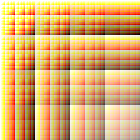</td><td>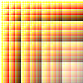</td></tr></tbody></table>
 * `lighten` (or `lighter`) - the result is _slightly_ too dark when the opacity falls and incorrectly 'favors' a higher-opacity source.
   <table><thead><tr><th>Photoshop</th><th>context-blender</th></tr></thead><tbody><tr><td></td><td>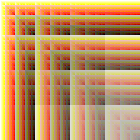</td></tr></tbody></table>
 * `darken` (or `darker`) - the result is too dark when combining low-opacity regions, and does not properly 'favor' the higher-opacity source.
   <table><thead><tr><th>Photoshop</th><th>context-blender</th></tr></thead><tbody><tr><td></td><td>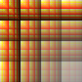</td></tr></tbody></table>
 * `overlay` - this is correct where both the over and under images are 100% opaque; the lower the alpha of either/both images, the more the colors become too desaturated.
   <table><thead><tr><th>Photoshop</th><th>context-blender</th></tr></thead><tbody><tr><td>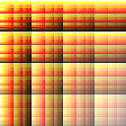</td><td>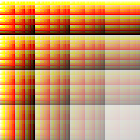</td></tr></tbody></table>
 * `hardlight` - this is the opposite of "overlay" and experiences similar problems where either image is not fully opaque.
   <table><thead><tr><th>Photoshop</th><th>context-blender</th></tr></thead><tbody><tr><td>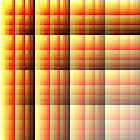</td><td>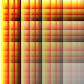</td></tr></tbody></table>
 * `colordodge` (or `dodge`) - works correctly only under 100% opacity
   <table><thead><tr><th>Photoshop</th><th>context-blender</th></tr></thead><tbody><tr><td></td><td>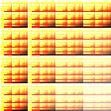</td></tr></tbody></table>
 * `colorburn` (or `burn`) - works correctly only under 100% opacity
   <table><thead><tr><th>Photoshop</th><th>context-blender</th></tr></thead><tbody><tr><td></td><td>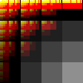</td></tr></tbody></table>
 * `softlight`
   <table><thead><tr><th>Photoshop</th><th>context-blender</th></tr></thead><tbody><tr><td>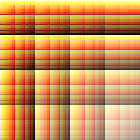</td><td>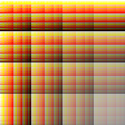</td></tr></tbody></table>
 * `luminosity`
   <table><thead><tr><th>Photoshop</th><th>context-blender</th></tr></thead><tbody><tr><td>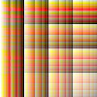</td><td>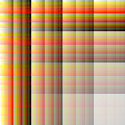</td></tr></tbody></table>
 * `color`
   <table><thead><tr><th>Photoshop</th><th>context-blender</th></tr></thead><tbody><tr><td>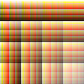</td><td></td></tr></tbody></table>
 * `hue`
   <table><thead><tr><th>Photoshop</th><th>context-blender</th></tr></thead><tbody><tr><td>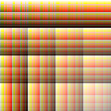</td><td>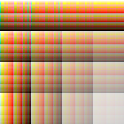</td></tr></tbody></table>
 * `saturation`
   <table><thead><tr><th>Photoshop</th><th>context-blender</th></tr></thead><tbody><tr><td>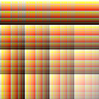</td><td>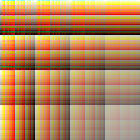</td></tr></tbody></table>
 * `lightercolor`
   <table><thead><tr><th>Photoshop</th><th>context-blender</th></tr></thead><tbody><tr><td>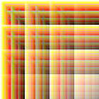</td><td>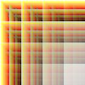</td></tr></tbody></table>
 * `darkercolor`
   <table><thead><tr><th>Photoshop</th><th>context-blender</th></tr></thead><tbody><tr><td></td><td>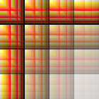</td></tr></tbody></table>


## Requirements/Browser Support

Should work on any user agent that supplies a `CanvasRenderingContext2D` along with `getImageData` and `putImageData`.

This includes using the [`node-canvas`](https://github.com/Automattic/node-canvas) library under [Node.js](http://nodejs.org).


## About

This library was created around the need solely for a one-off 'screen' blend mode to match the company-mandated style for bar graphs used internally, previously only available via a Microsoft® Excel® template. Clearly this functionality is useful in more contexts than just my one-off, so I decided to make a framework around it and encourage others to help figure out the formulae. Please, fork this project, add blend modes and/or fix math, and send me pull requests! I feel certain that the resources must exist out there on the equations Photoshop uses in the presence of alpha, but so far I have not found them.

### History

#### v1.3.3 - 2014-Nov-13
+ Fix alpha on all blend modes to exactly match Photoshop.

#### v1.3.0 - 2014-Nov-12
+ Release as a Node.js module.
+ Add blend modes: `softlight`, `luminosity`, `color`, `hue`, `saturation`, `lightercolor`, `darkercolor`.
+ Greatly improve the accuracy of many blend modes.

_Great thanks to [Pixelero](http://pixelero.wordpress.com) for amazing contributions!_

#### v1.2.1 - 2011-Feb-9
+ Improve perf of `lighten` and `darken` blend modes.

#### v1.2.0 - 2010-Dec-14
+ Add blend modes: `hardlight`, `colordodge`, `colorburn`, `darken`, `lighten`, `exclusion`. _Thanks [gingerbeardman](https://github.com/gingerbeardman)!_

#### v1.1.1 - 2010-Dec-12
+ Improve result of `overlay` blend mode.

#### v1.1.0 - 2010-Dec-6
+ Added array `blendOnto.supportedBlendModes` for enumerating modes.
+ Added object `blendOnto.supports` for testing if a mode is supported.
+ Test for `getImageData()` to be present (prevent loading on excanvas).

#### v1.0 - 2010-Nov-30
+ Initial working release.
+ Supported blend modes: `normal`, `screen`, `multiply`, `difference`, `src-in`, `add`
- Known broken: `overlay`, `dodge`

## Reference Material
* [PDF Blend Modes: Addendum (January 23, 2006)](http://www.adobe.com/content/dam/Adobe/en/devnet/pdf/pdfs/pdf_reference_archives/blend_modes.pdf) PDF
* [SVG Compositing 1.2, Part 1: Primer](http://dev.w3.org/SVG/modules/compositing/master/SVGCompositingPrimer.html)
* [Custom blend modes for Flash 10](http://www.lostinactionscript.com/blog/index.php/2009/05/26/custom-blend-modes-for-flash-10/) blog post
* [Blend Modes in Delphi](http://www.pegtop.net/delphi/articles/blendmodes/) blog post

### Contact

To report bugs or request additional features, please use the [Context-Blender Issues](http://github.com/Phrogz/context-blender/issues) page for this project.

### License

This library is released under an MIT-style license. That generally means that you are free to do almost anything you want with it as long as you give a bit of credit where credit is due. See the LICENSE file included for the actual legal limitations.s and/or fix math, and send me pull requests! I feel certain that the resources must exist out there on the equations Photoshop uses in the presence of alpha, but so far I have not found them.
